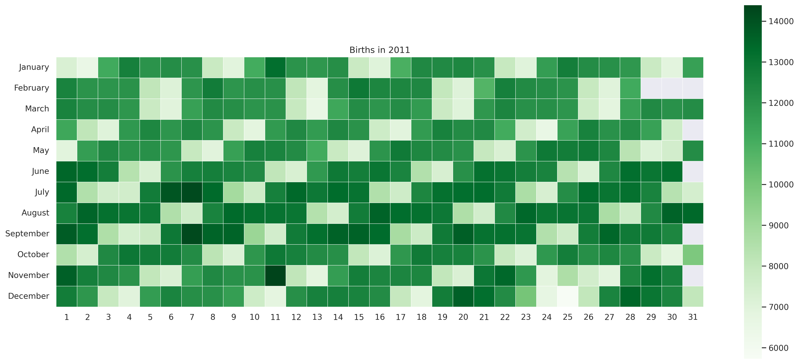

# Python-Data-Visualizations
### Data visualizations created with Python 
#### As I learn to use Python to create Data Visualizations I will post them here.

Frist entry:
At the start of week four of Data Science Bootcamp with Coding Dojo I had this assignment.

--Create a visualization that interests you--
  
My first child was born in 2011 and she recently had a birthday. When I came across data for biridays from 1994 - 2014 in an [article](https://thedailyviz.com/2016/09/17/how-common-is-your-birthday-dailyviz/) I wanted to see if I could do that too, with my own twist. By filtering the year and presenting it in her current favorite color I am hoping to peak her interest in Data Science.

Here is a preview of the visualization 	
